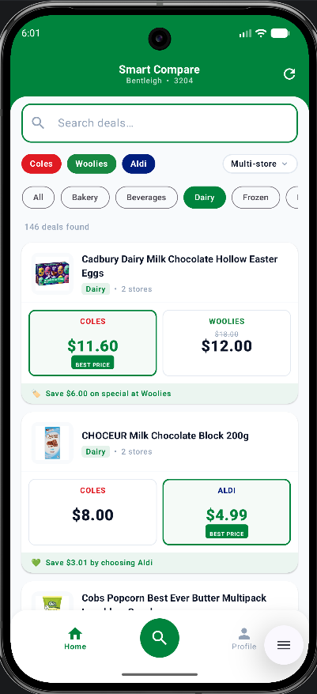
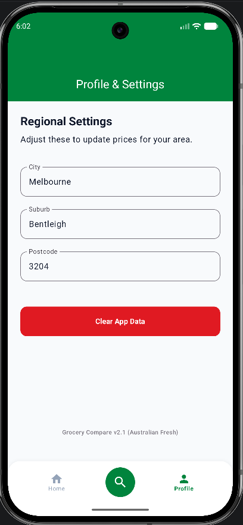

# GroceryCompare — Android App

An Android app that compares weekly specials across Australian supermarkets (Coles, Woolworths, Aldi) and shows side-by-side price comparisons so you can instantly see where to get the best deal.

---

## Screenshots

| Home | Profile |
|------|---------|
|  |  |

---

## What it does

- Syncs weekly specials from the [GroceryCompare Backend API](https://github.com/chtsalvishal/grocery-compare-api) (hosted on Render)
- Shows products in a card grid with per-store prices, "was" prices, and a **BEST PRICE** badge
- Highlights savings (e.g. "Save $2.50")
- Filter by store (Coles / Woolworths / Aldi), category (Dairy, Meat, Weekly Specials, etc.), or search by name
- Sort by: cheapest first, most savings, available at most stores, or A–Z
- Live sync progress panel with per-store status
- Stores data locally in Room so the app works offline after the first sync

---

## Tech Stack

| Layer | Technology |
|-------|-----------|
| UI | Jetpack Compose + Material 3 |
| Architecture | MVVM — ViewModel + StateFlow |
| Local DB | Room (SQLite) |
| Background sync | WorkManager (`SyncWorker`) |
| HTTP client | Ktor |
| Image loading | Coil |
| Logging | Timber |

---

## Project Structure

```
app/
  src/main/java/com/example/grocerycompare/
    data/
      local/          — Room database, DAOs, entities
      remote/         — Ktor API client (ApiService)
      repository/     — MasterCatalogueRepository
      source/remote/  — SyncWorker, SyncModels
    ui/
      screens/home/   — HomeScreen (Compose), HomeViewModel
      screens/profile/— ProfileScreen
      components/     — BottomNavBar
      theme/          — Color, Typography, Theme
    util/             — Categorizer
```

---

## Getting Started

### Prerequisites

- Android Studio Hedgehog or later
- Android SDK 26+
- The backend API running (see [grocery-compare-api](https://github.com/chtsalvishal/grocery-compare-api))

### Setup

1. Clone the repo:
   ```bash
   git clone https://github.com/chtsalvishal/grocery-compare-android.git
   cd grocery-compare-android
   ```

2. Open in Android Studio.

3. Set the backend URL (optional — defaults to `http://10.0.2.2:8000` for emulator → localhost):

   In `gradle.properties`:
   ```properties
   BACKEND_URL=https://grocery-compare-api.onrender.com
   ```
   Or pass as an environment variable in CI:
   ```
   BACKEND_URL=https://grocery-compare-api.onrender.com ./gradlew assembleRelease
   ```

4. Run on an emulator or device (minSdk 26 / Android 8.0).

---

## Backend API

The app fetches data from the GroceryCompare backend:

| Endpoint | Description |
|----------|-------------|
| `GET /api/specials` | All current specials (supports `?store=`, `?category=`, `?q=`, `?sort=`) |
| `POST /api/sync` | Trigger a fresh scrape of all stores |
| `GET /api/sync/status` | Last sync result |
| `GET /api/health` | Liveness check |

See the [backend repo](https://github.com/chtsalvishal/grocery-compare-api) for full API docs and deployment instructions.

---

## How sync works

1. User taps **Sync** → `HomeViewModel.triggerScrape()` enqueues a `SyncWorker` via WorkManager
2. `SyncWorker` calls `POST /api/sync` on the Render backend (which scrapes Coles, Woolworths, Aldi in parallel)
3. Worker polls `GET /api/specials` and writes results to Room via `MasterCatalogueRepository.replaceAll()`
4. `HomeViewModel` observes the Room DB via `StateFlow` and updates the UI in real time
5. Progress is reported back via WorkManager `setProgress()` and shown in the sync panel

---

## Build

```bash
# Debug APK
./gradlew assembleDebug

# Release APK (uses debug signing config by default)
./gradlew assembleRelease
```
